# CodeTogether: Real-Time Collaborative Code Editor & Chat

Welcome to **CodeTogether** – a full-stack project that enables real-time collaborative code editing and chat, with a supporting Android app. This project is designed for seamless teamwork, code sharing, and communication.

---

## 🚀 Features

- **Real-Time Code Collaboration:** Multiple users can edit code together in real time.
- **Live Chat:** Integrated chat for instant communication in each room.
- **File Uploads:** Share files with other users in your session.
- **Theming:** Light/dark mode support.
- **Rate Limiting:** Prevents abuse of code execution API.
- **Android App:** Native Android client for mobile collaboration (see `app/`).

---

## 🗂️ Project Structure

```
new_final_project/
├── app/                # Native Android app (Java)
├── public/             # Static assets for React frontend
├── scripts/            # Utility scripts
├── server/             # Backend (Node.js/Express)
├── src/                # React frontend source code
├── server.js           # Backend entry point
├── package.json        # Node/React dependencies
├── build.gradle        # Android/Gradle config
├── .gitignore          # Git ignore rules
└── README.md           # Project documentation
```

---

## 🛠️ Setup Instructions

### 1. Clone the Repository
```bash
git clone https://github.com/your-username/your-repo.git
cd new_final_project
```

### 2. Install Dependencies
#### Frontend & Backend (Node.js/React)
```bash
npm install
```

#### Android App
Open the `app/` folder in Android Studio and let it sync dependencies.

### 3. Environment Variables
- **Backend:** Create a `.env` file in the root directory:
  ```env
  JD_API_CLIENT_ID=your_jdoodle_client_id
  JD_API_CLIENT_SECRET=your_jdoodle_client_secret
  PORT=5000
  ```
- **Frontend:** Create a `.env` file in the root directory (for React):
  ```env
  REACT_APP_BACKEND_URL=https://your-backend-url.com
  ```
  > **Note:** Never commit your `.env` file to GitHub. Add `.env` to your `.gitignore`.

### 4. Running the Project
#### Start Backend Server
```bash
npm run server
```

#### Start Frontend (React)
```bash
npm start
```

#### Android App
- Open `app/` in Android Studio and run on an emulator or device.

### 5. Deploying to Netlify
- Push your code (without `.env`) to GitHub.
- On [Netlify](https://app.netlify.com/), connect your repo.
- In Netlify dashboard, add your environment variables under **Site settings > Build & deploy > Environment**.
- Deploy your site!

---

## 💡 Usage
- Visit the home page, create or join a room with a Room ID and username.
- Collaborate on code in real time, chat, and share files.
- Use the Android app for mobile collaboration.

---

## 📸 Project Screenshots

### Home Page
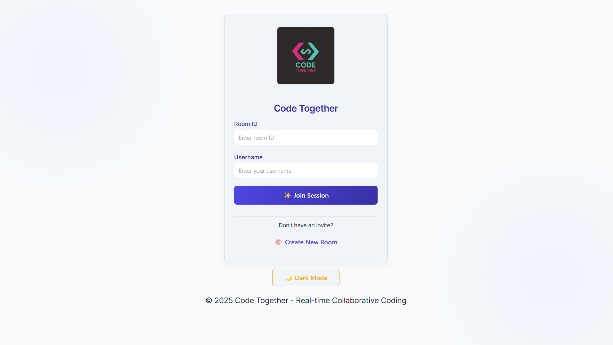

### Room ID Entry
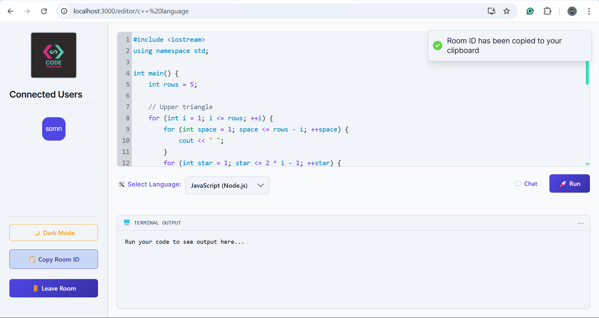

### Editor Page
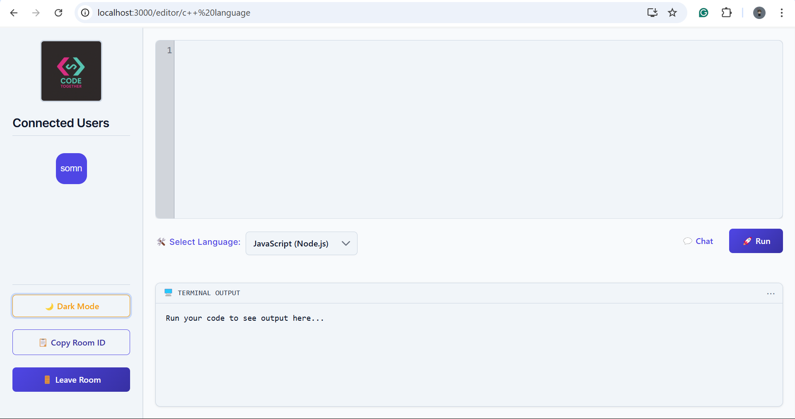

### Code Synchronization
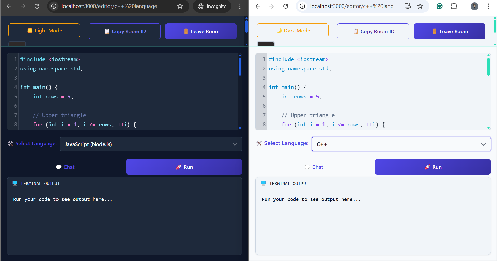

### Code Output
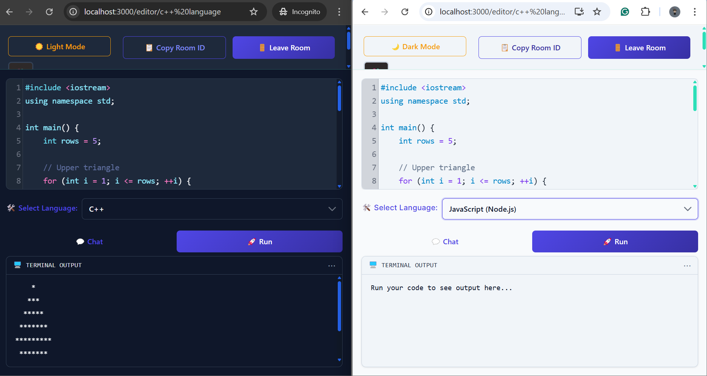
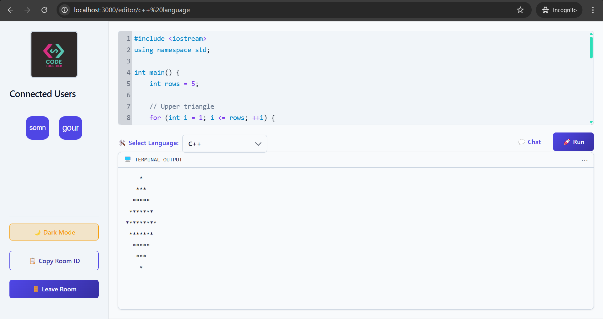

### Code Error
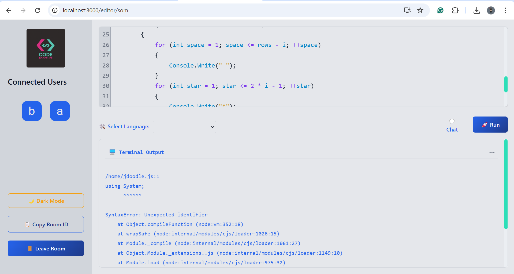

### File & Image Upload
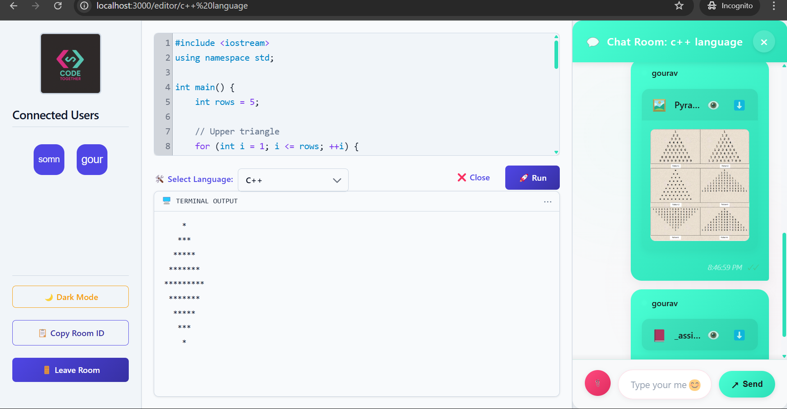

### Chat Feature
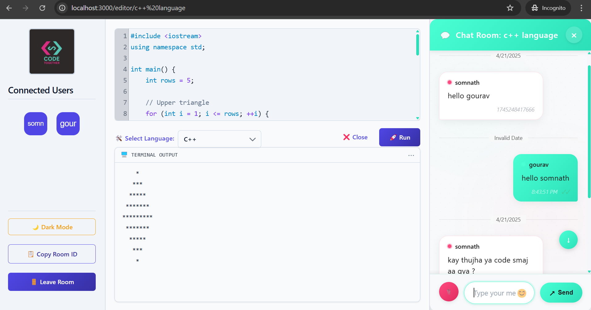
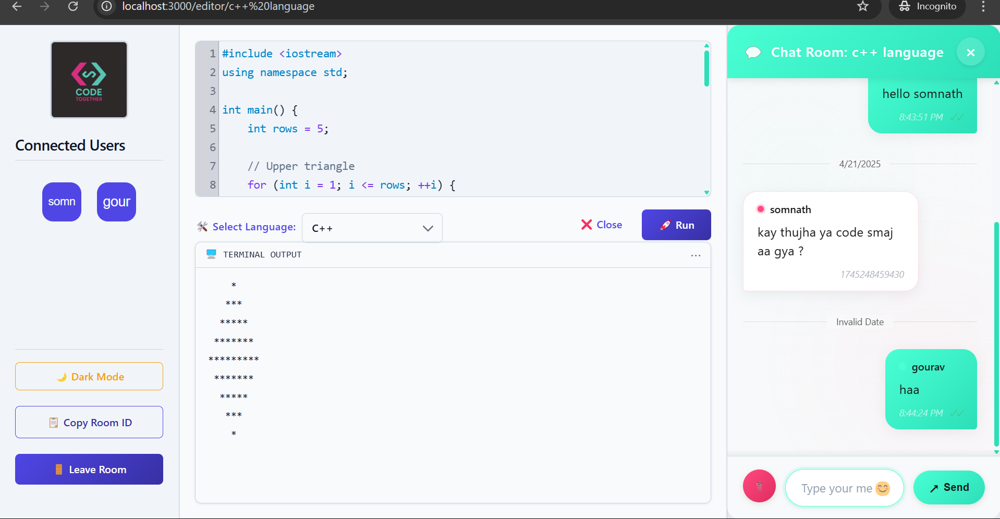

### Multi-Language Support
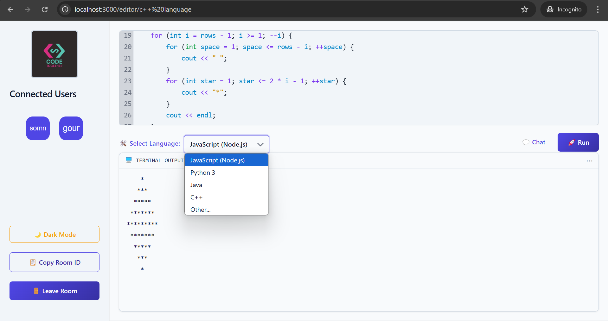
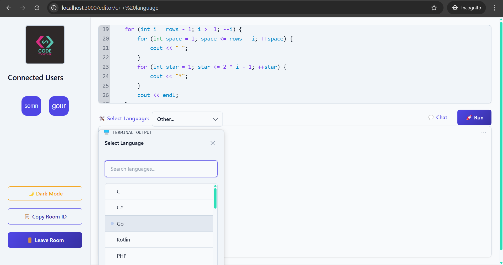

### Dark Mode - Editor Page
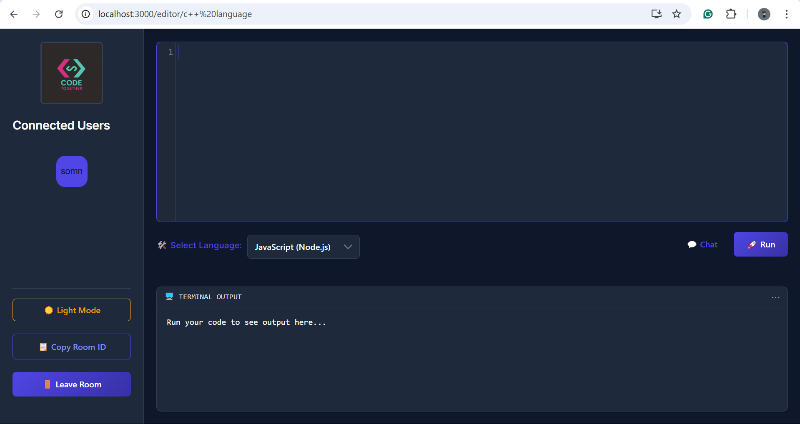

### Dark Mode - Mode Page
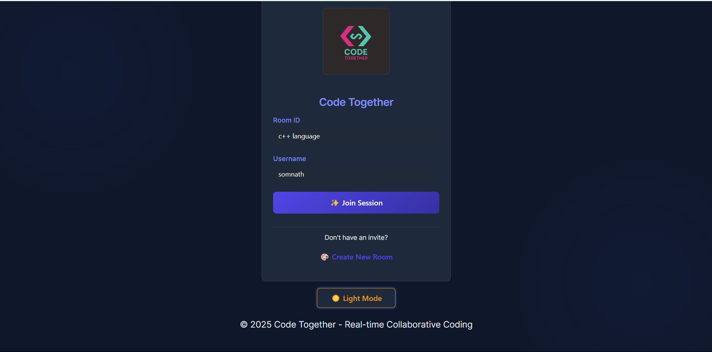

---

## 🚀 Live Demo

Check out the live project: [Demo on Netlify](https://your-demo-site.netlify.app)

---

## 🤝 Contributing
1. Fork the repository
2. Create your feature branch (`git checkout -b feature/YourFeature`)
3. Commit your changes (`git commit -am 'Add new feature'`)
4. Push to the branch (`git push origin feature/YourFeature`)
5. Open a Pull Request

---

## 📄 License
This project is open source. See [LICENSE](LICENSE) for details.

---

## 📞 Contact
For questions or support, open an issue or contact the maintainer.
